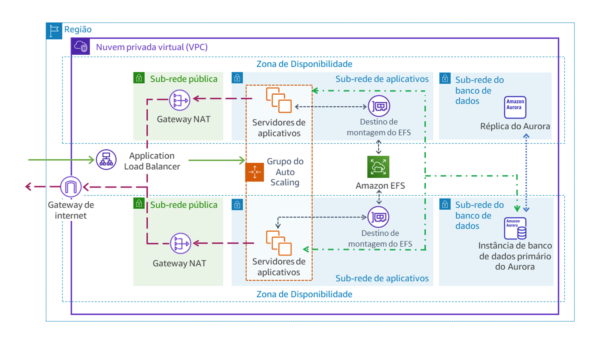
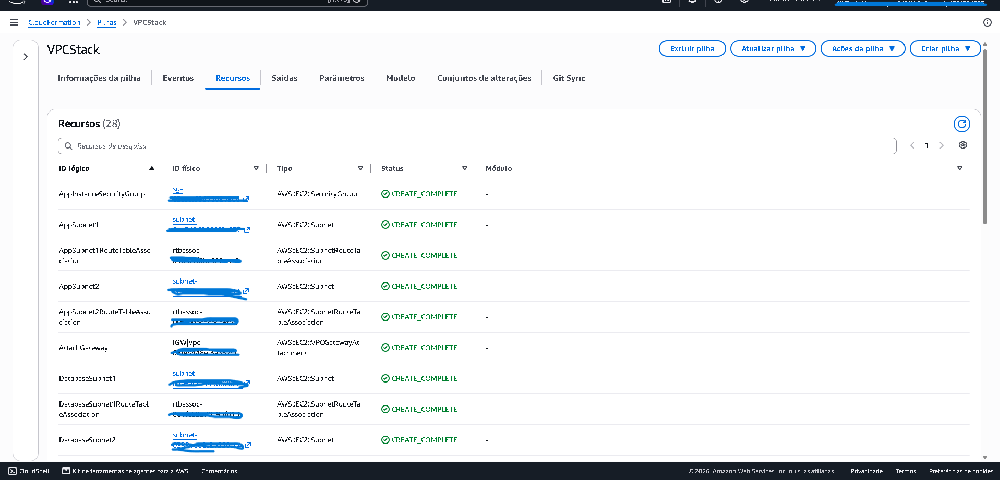
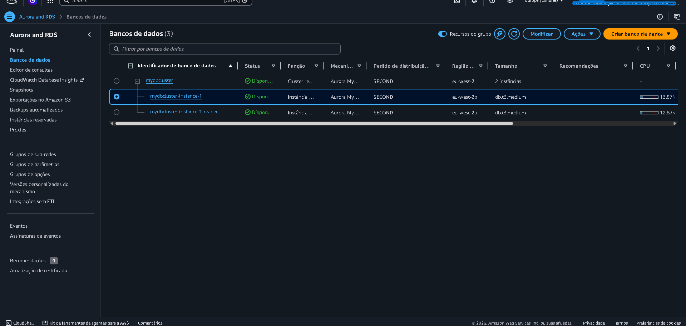
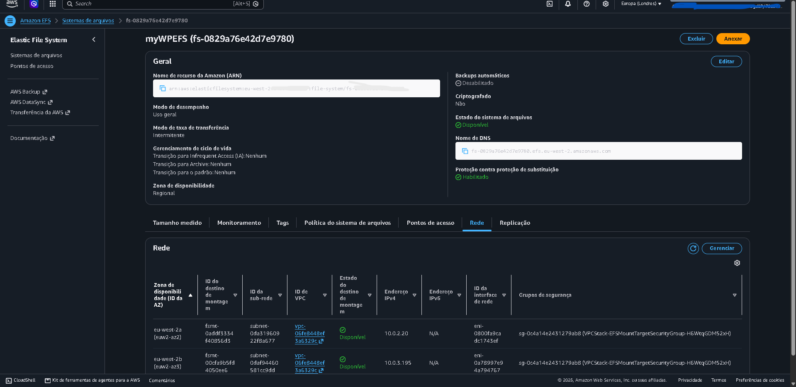
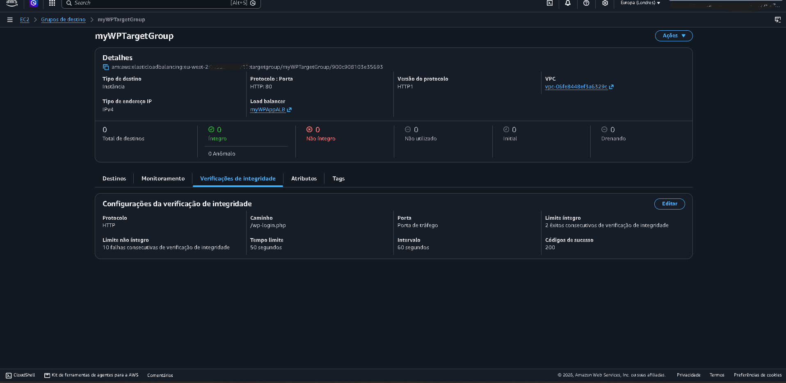
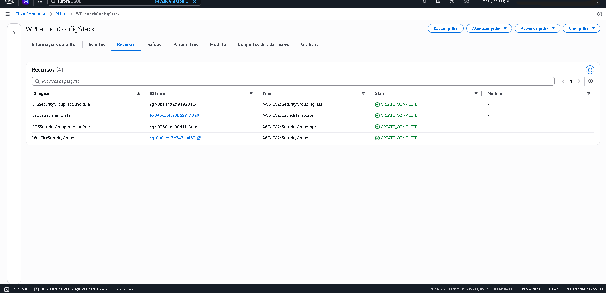
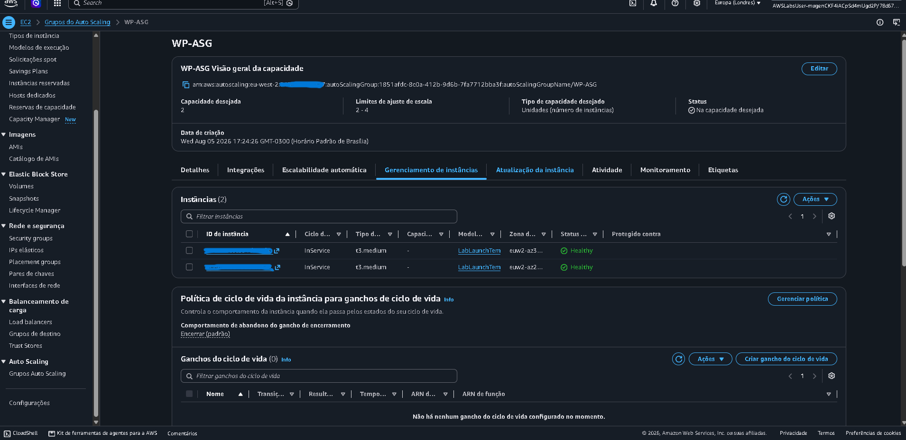
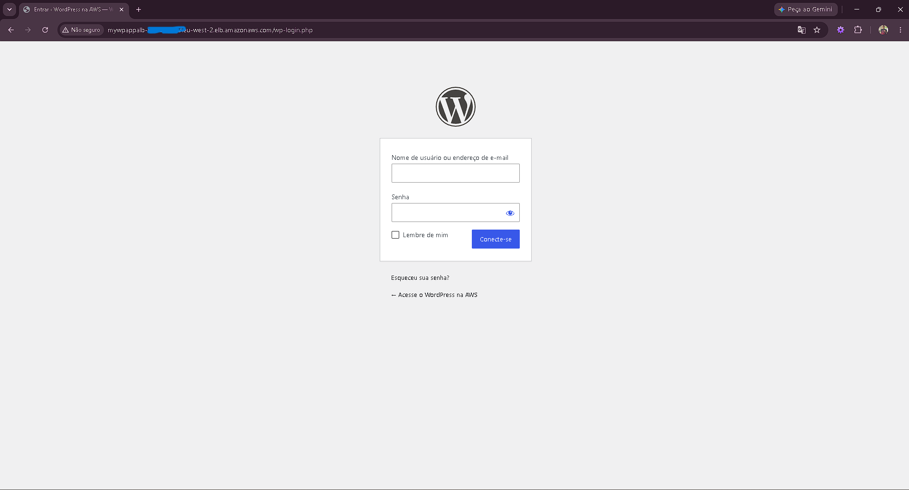

# AWS Lab: Arquitetura Multicamadas Serverless e Altamente Disponível para Aplicações Web (WordPress)

> **Domínio SAA:** Design Resilient Architectures / Design High-Performing Architectures  
> **Serviços Utilizados:** Amazon VPC, AWS CloudFormation, Amazon RDS (Aurora MySQL Multi-AZ), Amazon EFS, Application Load Balancer (ALB), Auto Scaling Group (ASG), AWS Systems Manager  
> **Conceitos Aplicados:** High Availability (HA), Multi-AZ Deployment, Tiered Security (Public/Private Subnets), Shared Elastic File System, Auto-Healing, Stateless Web Tier, Infrastructure as Code (IaC)  

---

## Diagrama da Arquitetura do Laboratório

O diagrama abaixo ilustra a arquitetura completa provisionada no laboratório: uma rede VPC dividida em 3 camadas de sub-redes (Pública, Aplicação Privada e Banco de Dados Privado) distribuídas em duas Zonas de Disponibilidade (AZs), garantindo alta disponibilidade, tolerância a falhas e isolamento de segurança.

---

## Visão Geral e Cenário Real

A empresa fictícia **Exemplo Corp.** hospedava seu portal de clientes em um data center *on-premises*, enfrentando gargalos de desempenho, tempo elevado de provisionamento de hardware, indisponibilidades durante picos de tráfego e altos custos operacionais.

Para resolver esses desafios, foi desenhada e implantada uma **Arquitetura Multicamadas Desacoplada e Altamente Disponível na AWS**:

1. **Camada de Rede e Segurança (Amazon VPC):** Isolamento total entre sub-redes públicas (com Internet Gateway e NAT Gateways) e sub-redes privadas para as camadas de aplicação e banco de dados.
2. **Camada de Dados (Amazon Aurora MySQL Multi-AZ):** Banco de dados relacional gerenciado e distribuído em 2 AZs (Instância Gravadora/Primary e Instância Leitora/Replica) sem overhead administrativo.
3. **Camada de Armazenamento Compartilhado (Amazon EFS):** Sistema de arquivos elástico NFS acessível por ambas as AZs, permitindo que a camada Web mantenha seus ativos (como uploads do WordPress) sincronizados e de forma totalmente *stateless*.
4. **Camada de Aplicação e Balanceamento (ALB + ASG):** Um Application Load Balancer recebe o tráfego da internet na camada pública e o distribui entre instâncias EC2 gerenciadas por um Auto Scaling Group implantado nas sub-redes privadas.

---

## Implementação Passo a Passo

### 1. Provisionamento da Infraestrutura de Rede via CloudFormation (IaC)

A infraestrutura base foi implantada utilizando o modelo `Task1.yaml` via **AWS CloudFormation** para garantir padronização e automação.

* **Amazon VPC (`10.0.0.0/16`)**: Criada com suporte a 2 Zonas de Disponibilidade.
* **Sub-redes Públicas (`10.0.0.0/24`, `10.0.1.0/24`)**: Conectadas a um Internet Gateway (IGW).
* **Sub-redes de Aplicação Privadas (`10.0.2.0/24`, `10.0.3.0/24`)**: Roteadas para a internet via NAT Gateways para atualização de pacotes.
* **Sub-redes de Banco de Dados Privadas (`10.0.4.0/24`, `10.0.5.0/24`)**: Totalmente isoladas da internet.

---

### 2. Configuração do Banco de Dados Relacional (Amazon Aurora Multi-AZ)

Criou-se um cluster de banco de dados compatível com MySQL usando **Amazon RDS (Aurora)**:

* **Subnet Group (`AuroraSubnetGroup`)**: Mapeado exclusivamente para as sub-redes privadas de banco de dados (`10.0.4.0/24` e `10.0.5.0/24`).
* **Cluster Aurora (`MyDBCluster`)**:
  * **Tipo:** Compatível com MySQL (Instâncias `db.t3.medium`).
  * **Implantação Multi-AZ:** Uma instância *Writer* na AZ1 e uma instância *Reader* na AZ2.
  * **Segurança:** Associado ao `RDSSecurityGroup`, bloqueando qualquer acesso externo e liberando conexões apenas a partir da camada de aplicação.

---

### 3. Criando o Sistema de Arquivos Compartilhado (Amazon EFS)

Para permitir que múltiplas instâncias da aplicação compartilhem os mesmos arquivos de mídia do WordPress em tempo real, foi provisionado o **Amazon EFS (`myWPEFS`)**:

* **Modo de Desempenho:** Uso Geral com Modo de Taxa de Transferência *Bursting*.
* **Pontos de Montagem (*Mount Targets*):** Criados nas sub-redes privadas de aplicação (`AppSubnet1` e `AppSubnet2`).
* **Segurança:** Associado ao `EFSMountTargetSecurityGroup`, permitindo tráfego NFS (porta 2049) apenas das instâncias Web.

---

### 4. Configuração do Application Load Balancer (ALB) e Target Group

Para distribuir o tráfego de entrada e isolar as instâncias privadas da internet:

1. **Target Group (`myWPTargetGroup`):**
   * **Tipo:** Instâncias (HTTP:80).
   * **Health Check Customizado:** Apontando para `/wp-login.php` com parâmetros ajustados (Intervalo de 60s, Limite Saudável de 2, Limite Não Saudável de 10).
2. **Application Load Balancer (`myWPAppALB`):**
   * **Mapeamento:** Associado às sub-redes **públicas** em ambas as AZs.
   * **Security Group:** `AppInstanceSecurityGroup` liberando tráfego HTTP/HTTPS público.
   * **Listener:** Roteia requisições da porta 80 para o `myWPTargetGroup`.

---

### 5. Implantação do Modelo de Execução (Launch Template via CloudFormation)

Utilizou-se o modelo `Task5.yaml` no CloudFormation (`WPLaunchConfigStack`) para automatizar a criação do Launch Template contendo o *UserData* script.

* **Automação no Bootstrap (UserData):** O script baixa o WordPress, monta o volume EFS via NFS no diretório `/var/www/html` e injeta as credenciais e endpoints do Amazon Aurora e do ALB no arquivo `wp-config.php`.

---

### 6. Elasticidade e Auto-Healing com Auto Scaling Group (ASG)

Para garantir escalabilidade e auto-recuperação da camada de aplicação:

* **Configuração do ASG (`WP-ASG`):**
  * **Launch Template:** Criado na Tarefa 5.
  * **Sub-redes:** Implantado nas sub-redes privadas de aplicação (`AppSubnet1` e `AppSubnet2`).
  * **Balanceamento:** Anexado ao `myWPTargetGroup`.
* **Dimensionamento:**
  * Capacidade Desejada: 2 | Mínima: 2 | Máxima: 4 instâncias.
  * **Política de Scaling:** *Target Tracking* baseada em utilização de CPU.
* **Integridade:** *Health Check* do Elastic Load Balancing habilitado com período de carência de 300 segundos.

---

## Validação da Solução (Acesso à Aplicação)

1. Recuperou-se o DNS do Load Balancer (`myWPAppALB-XXXXX.elb.amazonaws.com`).
2. Acesse-se o endereço adicionando a rota `/wp-login.php` no navegador.
3. O login no painel administrativo do WordPress foi efetuado com sucesso usando as credenciais configuradas (`wpadmin`).

---

## Estudo de Caso: Quando e Por Que Usar Esta Arquitetura?

### O Problema do Modelo Tradicional (On-Premises / Monolítico)
A infraestrutura legada da Exemplo Corp. sofria com:
* **Ponto Único de Falha (SPOF):** Servidores Web e bancos de dados rodando na mesma máquina ou em um único data center.
* **Incapacidade de Escalar:** Tempos de espera longos para provisionar novos servidores durante picos de campanha de marketing.
* **Dificuldade de Sincronização de Arquivos:** Manter arquivos estáticos e uploads de mídia sincronizados entre vários servidores exigiam scripts complexos e propensos a falhas.

### Como esta Arquitetura Responde às Necessidades do Negócio

1. **Isolamento de Segurança em Camadas (Defense in Depth):**
   * Nenhum servidor de aplicação ou banco de dados possui endereço IP Público. O acesso vindo da internet é filtrado e permitido **exclusivamente através do Load Balancer**.
2. **Servidores Web Stateless via Amazon EFS:**
   * Ao armazenar o diretório de dados do WordPress (`/var/www/html`) no EFS, qualquer servidor EC2 pode ser criado ou destruído pelo Auto Scaling sem risco de perda de arquivos de mídia dos clientes.
3. **Resiliência e Recuperação Automática (Auto-Healing):**
   * Se uma AZ inteira falhar ou uma instância EC2 congelar, o ALB detecta o erro no *Health Check* (`/wp-login.php`) e o Auto Scaling mata a instância defeituosa, subindo uma nova em outra AZ em minutos.
4. **Banco de Dados Relacional Gerenciado (Aurora Multi-AZ):**
   * O Amazon Aurora fornece réplicas de leitura automáticas e chaveamento de *Failover* em menos de 30 segundos, sem a necessidade de intervenção humana da equipe de DBA.

---

## Aprendizados para a Certificação SAA

* **Subnet Groups no RDS:** O RDS exige um grupo de sub-redes em pelo menos 2 Zonas de Disponibilidade para permitir implantações Multi-AZ altamente disponíveis.
* **Amazon EFS vs Amazon EBS:** O EBS é um armazenamento de bloco anexado a **uma única instância** (em uma única AZ). O EFS é um armazenamento de arquivos (*NFS*) compartilhado que pode ser montado **simultaneamente por centenas de instâncias** em múltiplas AZs.
* **ALB Health Checks:** Configurar a rota correta do *Health Check* (ex: `/wp-login.php` em vez de `/`) evita falsos positivos caso a página inicial dependa de recursos externos ou redirecionamentos.
* **VPC Tiering Best Practices:** Sub-redes públicas armazenam apenas recursos voltados para a internet (ALB, NAT Gateways, Bastion Hosts). Camadas de aplicação e dados **devem** residir em sub-redes privadas.