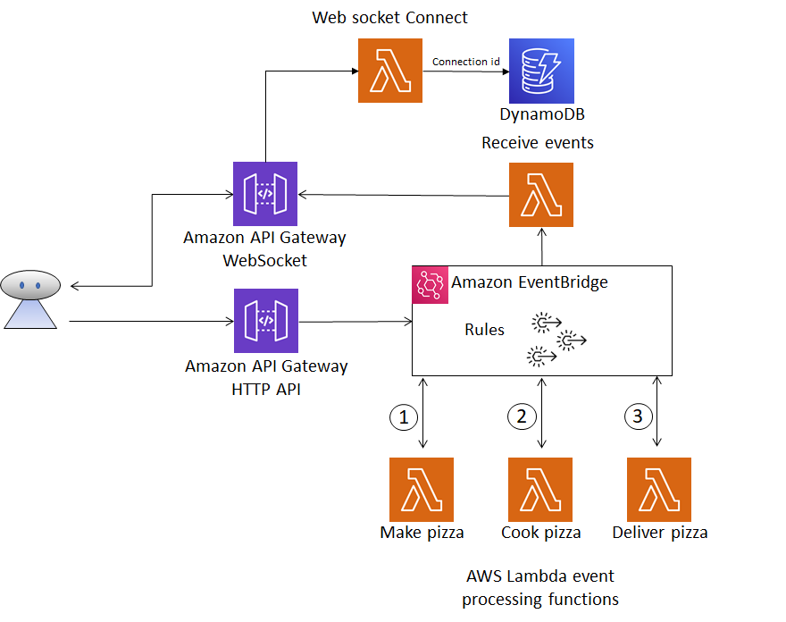
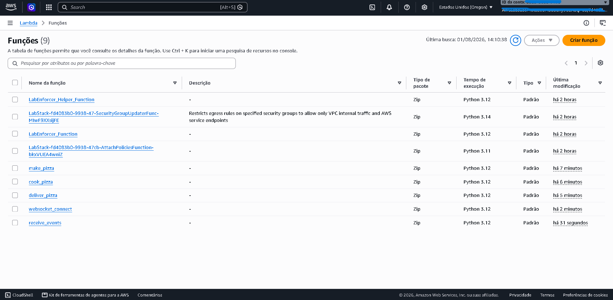
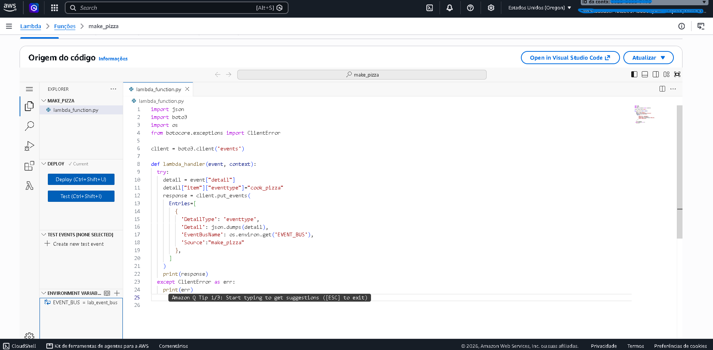
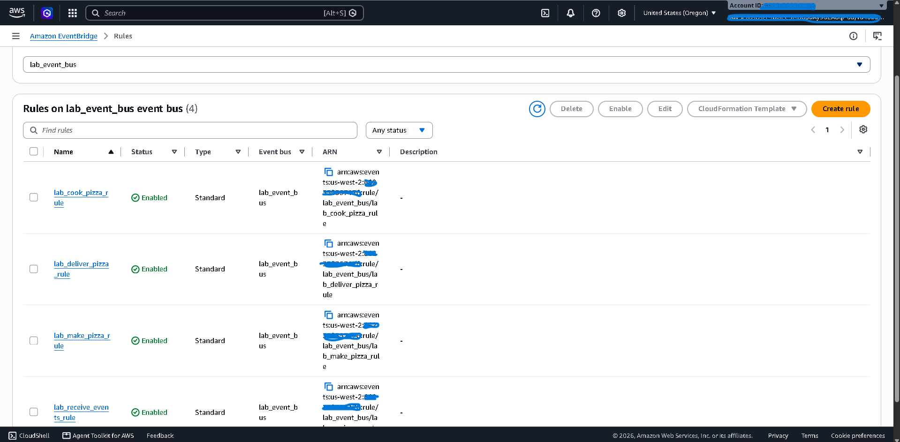
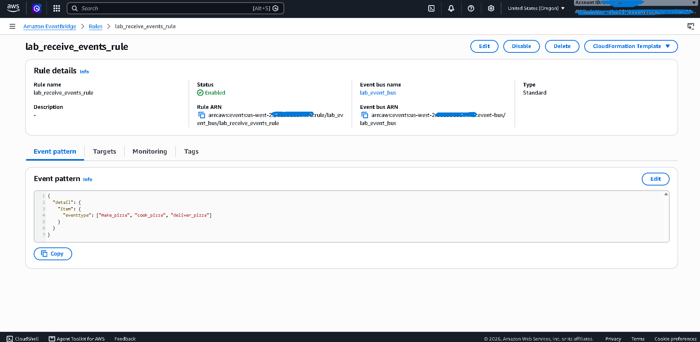
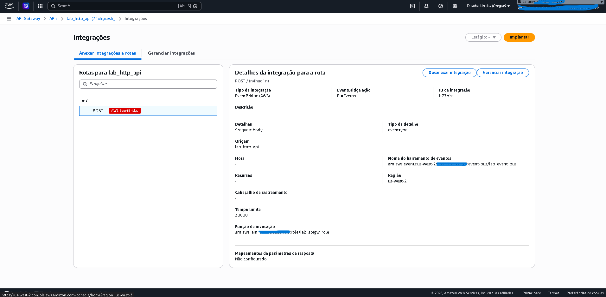
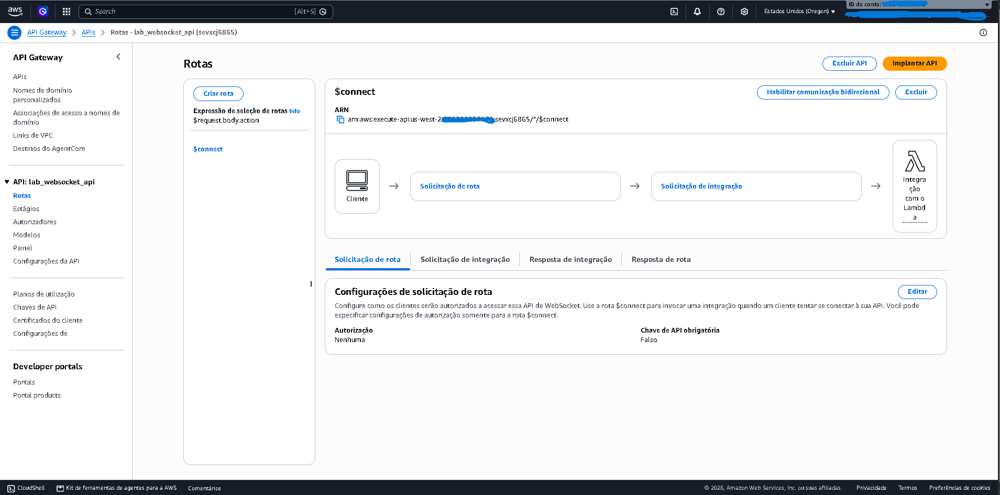
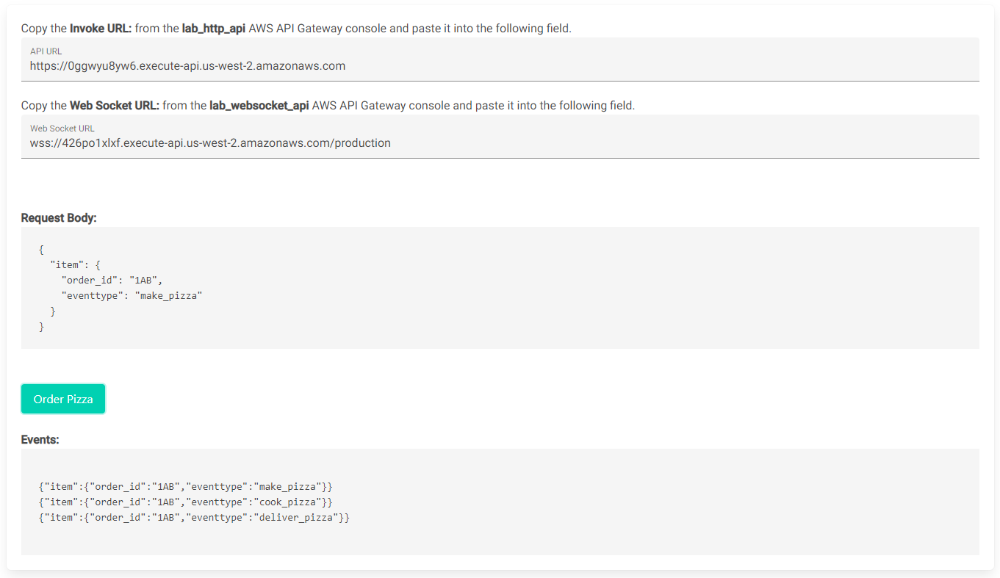

# AWS Lab: Arquitetura Orientada a Eventos com API Gateway, EventBridge e AWS Lambda

> **Domínio SAA:** Design Resilient Architectures / Design High-Performing Architectures  
> **Serviços Utilizados:** Amazon API Gateway (HTTP & WebSocket), Amazon EventBridge, AWS Lambda, Amazon DynamoDB  
> **Conceitos Aplicados:** Event-Driven Architecture (EDA), Serverless, Desacoplamento de Microsserviços, Conexões Persistentes (WebSockets), Padrões de Eventos (Event Patterns)  

---

## Diagrama da Arquitetura do Laboratório

O diagrama abaixo ilustra o fluxo de eventos desde a requisição HTTP inicial, o roteamento pub/sub via EventBridge, a execução assíncrona nas funções Lambda e o feedback em tempo real para o cliente via WebSockets.

---

## Visão Geral e Cenário Real

Aplicações modernas em microsserviços exigem desacoplamento para garantir escalabilidade e resiliência. Neste laboratório, foi construída uma arquitetura **100% Serverless e Orientada a Eventos (EDA)** simulating um sistema de pedidos de pizzaria:

1. **Ingestão:** O cliente envia uma requisição HTTP POST para o **Amazon API Gateway**, que publica o evento diretamente no **Amazon EventBridge** sem necessidade de servidores intermediários.
2. **Processamento em Cadeia:** O **EventBridge** avalia o padrão do evento (*Event Pattern*) e dispara funções **AWS Lambda** encadeadas (`make_pizza` ➔ `cook_pizza` ➔ `deliver_pizza`), onde cada função re-publica o evento atualizado no barramento.
3. **Notificação em Tempo Real:** Uma função adicional (`receive_events`) captura todos os eventos em paralelo e os transmite ao cliente através de uma conexão **WebSocket** mantida pelo API Gateway, utilizando o **Amazon DynamoDB** para rastrear os IDs de conexão ativos.

---

## Implementação Passo a Passo

### 1. Criação das Funções Lambda (Processamento Serverless)

Foram criadas 5 funções Lambda em Python 3.12 com IAM Roles pré-configuradas para o menor privilégio necessário:

* **`make_pizza`**: Processa o pedido inicial e altera o estado para `cook_pizza`.
* **`cook_pizza`**: Processa a preparação e altera o estado para `deliver_pizza`.
* **`deliver_pizza`**: Finaliza o processo alterando o estado para `delivered`.
* **`websocket_connect`**: Salva o `connection_id` do WebSocket e o `order_id` na tabela DynamoDB (`websocket_connections`).
* **`receive_events`**: Lê o evento do barramento, busca a conexão no DynamoDB e envia a atualização via `post_to_connection`.

Variáveis de ambiente (`EVENT_BUS`, `TABLENAME`, `APIGW_ENDPOINT`) foram utilizadas em todas as funções para evitar *hardcoding* de configurações.

---

### 2. Configuração do Amazon EventBridge (Barramento e Regras)

Criou-se um barramento personalizado chamado `lab_event_bus` e quatro regras com **Event Patterns** em JSON para direcionamento preciso de mensagens aos seus destinos Lambda:

* **`lab_make_pizza_rule`**: Filtra eventos com `"eventtype": ["make_pizza"]` ➔ Alvo: Lambda `make_pizza`.
* **`lab_cook_pizza_rule`**: Filtra eventos com `"eventtype": ["cook_pizza"]` ➔ Alvo: Lambda `cook_pizza`.
* **`lab_deliver_pizza_rule`**: Filtra eventos com `"eventtype": ["deliver_pizza"]` ➔ Alvo: Lambda `deliver_pizza`.
* **`lab_receive_events_rule`**: Filtra **todos** os tipos (`make_pizza`, `cook_pizza`, `deliver_pizza`) simultaneamente ➔ Alvo: Lambda `receive_events`.

> **Inspecção de Padrão JSON:** O uso da regra `lab_receive_events_rule` demonstra como o EventBridge permite a invocação **fan-out / simultânea** de múltiplos alvos a partir de um mesmo evento.

---

### 3. Configuração do Amazon API Gateway (HTTP e WebSockets)

1. **HTTP API (`lab_http_api`):**
   * Rota criada: `POST /`
   * Integração direta com AWS Service: **Amazon EventBridge (`PutEvents`)**.
   * Habilitação de CORS (`Access-Control-Allow-Origin: *`) para permitir chamadas do front-end.

2. **WebSocket API (`lab_websocket_api`):**
   * Rota `$connect` integrada à Lambda `websocket_connect`.
   * Permite comunicação bidirecional persistente em tempo real.
   * O endpoint de conexão gerado foi configurado na variável de ambiente `APIGW_ENDPOINT` da função `receive_events`.

---

## Validação da Solução (Teste de Integração)

Para validar a arquitetura fim a fim:
1. A aplicação Web de testes foi aberta no navegador através do endereço IP fornecido.
2. Foram inseridas as URLs do **API Gateway HTTP** e **WebSocket**.
3. Ao clicar em **Order Pizza**, a aplicação estabeleceu a conexão WebSocket e enviou o pedido HTTP.

> **Resultado Obtido:** Os três eventos (`make_pizza` ➔ `cook_pizza` ➔ `deliver_pizza`) foram processados em sequência e exibidos no painel do cliente em tempo real via WebSocket, comprovando o funcionamento completo da arquitetura desacoplada e orientada a eventos.

---

## Estudo: Quando e Por Que Usar Esta Arquitetura?

### O Problema do Modelo Tradicional (Monolito/Síncrono)
Em um sistema tradicional de pedidos, os serviços chamam uns aos outros diretamente de forma síncrona:
* **Efeito Dominó:** Se o serviço de entrega falhar, toda a cadeia de checkout pode travar e o pedido não é aceito.
* **Gargalo no Banco de Dados (Polling):** Para atualizar o status na tela do cliente, o aplicativo precisa fazer requisições HTTP a cada poucos segundos (`polling`), sobrecarregando os servidores e o banco de dados.
* **Alto Custo Ocioso:** Servidores mantidos ligados 24/7 esperando por chamadas em horários de baixo movimento.

### Como esta Arquitetura Orientada a Eventos (EDA) Resolve o Problema

1. **Desacoplamento e Resiliência (EventBridge):**
   * O EventBridge atua como um roteador pub/sub. Se a função de entrega (`deliver_pizza`) falhar, o pedido ainda é recebido e processado na cozinha normalmente. A mensagem permanece no barramento para reprocessamento.
2. **Padrão Fan-Out (Trabalho Paralelo):**
   * Uma única emissão de evento pode acionar múltiplos serviços simultaneamente (ex: processar o pedido e notificar o cliente via WebSocket ao mesmo tempo) sem que um serviço precise conhecer o outro.
3. **Eficiência e Baixa Latência (WebSockets):**
   * Em vez do cliente perguntar constantemente *"O pedido mudou de status?"*, o API Gateway WebSocket mantém um canal aberto de baixo custo, enviando dados ao front-end apenas quando um evento realmente acontece.
4. **Custo Zero em Ociosidade (Serverless):**
   * Toda a infraestrutura escala de zero até milhares de requisições por segundo automaticamente. Sem pedidos trafegando, o custo mantido na AWS é nulo.

   ---

## Aprendizados para a Certificação SAA

* **Desacoplamento:** O EventBridge elimina a necessidade de microsserviços chamarem uns aos outros diretamente de forma síncrona.
* **Integração Direta do API Gateway:** O API Gateway pode integrar diretamente com serviços como EventBridge e SQS sem precisar de uma Lambda intermediária para escrever a mensagem.
* **WebSockets vs HTTP/REST:** WebSockets mantêm conexões bidirecionais de baixa latência ideais para dashboards/chats, combinando perfeitamente com Lambdas acionadas por eventos.
* **Fan-Out Pattern:** Várias regras no EventBridge podem reagir ao mesmo evento ao mesmo tempo, disparando tarefas paralelas sem impactar o serviço de origem.