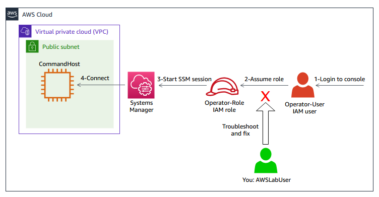
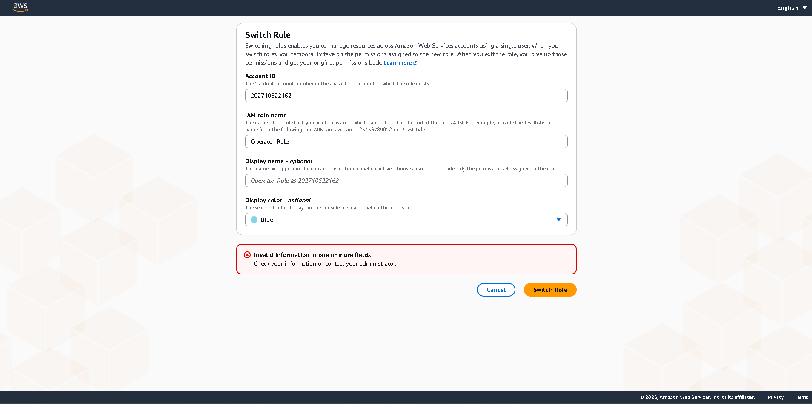
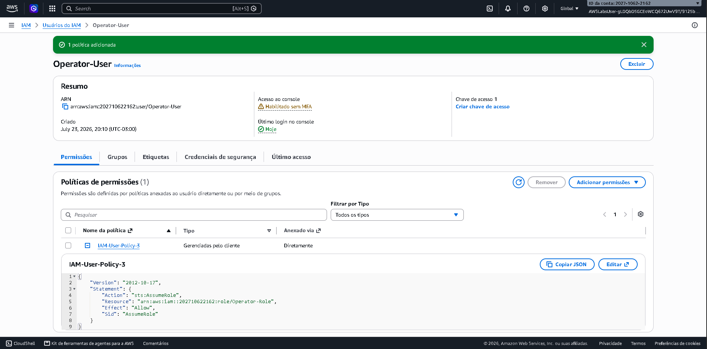
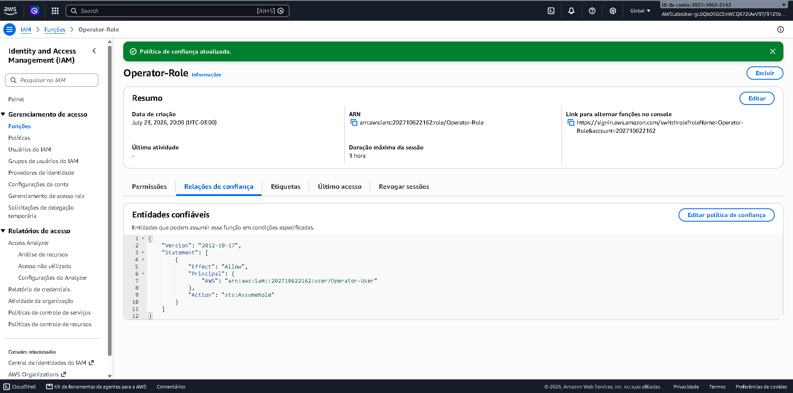
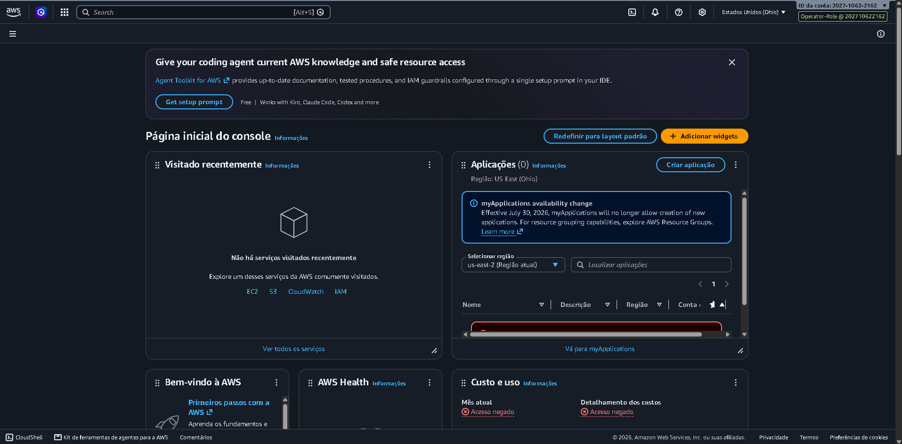

# 🛠️ AWS Lab: Resolução de Falha de Acesso no IAM com Roles e Menor Privilégio

> **Curso:** AWS Certified Solutions Architect - Associate (SAA-C03) — Escola da Nuvem  
> **Domínio 1:** Design Secure Architectures (Acesso e Identidade)  
> **Serviços Utilizados:** AWS IAM, AWS STS, AWS Systems Manager (SSM), Amazon EC2  
> **Conceitos Aplicados:** Identity Policies, Trust Policies, `sts:AssumeRole`, Principle of Least Privilege, Scenario Break-Fix  

---

## Diagrama da Arquitetura do Laboratório

O diagrama abaixo ilustra o fluxo de acesso, o ponto de falha identificado e a cadeia de confiança/autorização estabelecida para solucionar o problema:

---

## Contexto do Problema (Cenário Break-Fix)

A equipe de nuvem da empresa configurou um novo operador (`Operator-User`) que precisa acessar uma instância EC2 via AWS Systems Manager. De acordo com a política de segurança da empresa:
1. Nenhum usuário deve possuir permissões diretas aplicadas à sua identidade.
2. Todo acesso operacional deve ser feito assumindo uma IAM Role temporária (`Operator-Role`).

**O Problema:** Ao tentar realizar a troca de função (*Switch Role*) no Console de Gerenciamento da AWS, o `Operator-User` recebia a seguinte mensagem de erro, ficando impossibilitado de trabalhar:

---

## Diagnóstico Realizado

Ao analisar o ambiente com um usuário de administração (`AWSLabUser`), foram identificados dois pontos de bloqueio que violavam a cadeia de confiança e autorização:

1. **Falha na Identity Policy (Autorização de Saída):** O `Operator-User` não possuía uma política baseada em identidade dando permissão explícita para chamar a ação `sts:AssumeRole` direcionada à `Operator-Role`.
2. **Falha na Trust Policy (Relação de Confiança):** A *Trust Policy* (política de confiança) anexada à `Operator-Role` não listava o `Operator-User` como um *Principal* autorizado a assumir a função.

---

## Solução Aplicada

Para resolver o incidente aplicando rigorosamente o **Princípio do Menor Privilégio (*Least Privilege*)**, foram feitas as seguintes correções:

### 1. Atualização da Identity Policy do Usuário
Anexou-se uma política ao `Operator-User` que concede acesso restrito à ação `sts:AssumeRole`, apontando **exclusivamente para o ARN da `Operator-Role`**:

## ✅ Validação da Solução (Sucesso)

Para comprovar a resolução definitiva do problema, os passos de validação foram executados diretamente no Console de Gerenciamento da AWS:

1. **Re-autenticação:** Efetuou-se o login na janela anônima do navegador utilizando as credenciais do operador (`Operator-User`).
2. **Troca de Perfil (Switch Role):** No menu do usuário (canto superior direito), selecionou-se a opção **Mudar de função**, preenchendo o ID da conta AWS (`AWSAccountID`) e o nome do perfil (`Operator-Role`).
3. **Confirmação da Assunção de Função:** A requisição foi processada com sucesso via **AWS STS**, redirecionando a sessão para a página inicial da conta.

> **Resultado Esperado e Obtido:** O canto superior direito do Console passou a exibir o nome do perfil ativo **`Operator-Role @ ACCOUNT_ID`**, confirmando que o usuário está operando com permissões temporárias e pronto para gerenciar a instância `CommandHost` via AWS Systems Manager (SSM).
